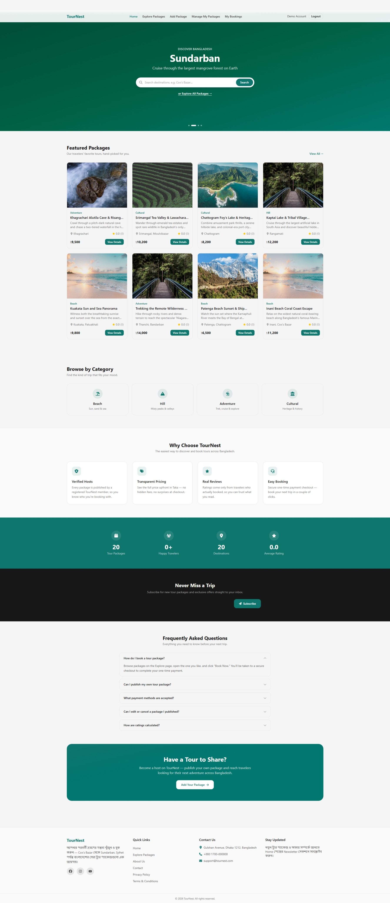

# TourNest

**A Tour & Travel Package Booking Platform for Bangladesh** — built with Next.js, TypeScript, MongoDB, and Stripe.

TourNest lets registered users publish tour packages (Cox's Bazar beach trips, Sundarban cruises, Sylhet tea-garden tours, and more), and lets any visitor browse, search, filter, book, and review them. Bookings are paid for with a one-time Stripe checkout, and every review comes from a traveler who actually booked.

---

## Table of Contents

1. [Features](#features)
2. [Tech Stack](#tech-stack)
3. [Project Structure](#project-structure)
4. [Getting Started](#getting-started)
5. [Environment Variables](#environment-variables)
6. [Database Schema](#database-schema)
7. [Authentication & Authorization](#authentication--authorization)
8. [API Routes](#api-routes)
9. [Payment Flow (Stripe)](#payment-flow-stripe)
10. [Image Uploads (Cloudinary)](#image-uploads-cloudinary)
11. [Pages / Sitemap](#pages--sitemap)
12. [Scripts](#scripts)
13. [Deployment](#deployment)
14. [Known Limitations & Notes](#known-limitations--notes)
15. [License](#license)

---

## Features

**Public (no login required)**
- Browse and search tour packages by title/location, with debounced search-as-you-type
- Filter by category, price range, and location; sort by price, newest, or rating
- Page-number-based pagination (12 packages per page)
- Package detail pages with an image gallery/lightbox, day-wise itinerary, included/excluded lists, and real traveler reviews
- Related packages (same category)
- Static pages: About, Privacy Policy, Terms & Conditions, and a functional Contact form
- SEO metadata on public pages, including dynamic Open Graph title/image per package

**For registered users**
- Email/password registration and login (plus a one-click Demo Login), powered by better-auth
- Publish a tour package with a Zod-validated form: title, descriptions, price (BDT), location, departure date, duration, category, included/excluded lists, day-wise itinerary, and multiple images (signed Cloudinary upload, uploaded directly from the browser)
- Manage My Packages: table view of your own listings with a "bookings per package" performance chart (Recharts), and Edit/Delete actions
- Edit a package (pre-filled form, reuses the Add-package component) — ownership re-verified server-side
- Delete a package with a confirmation modal — ownership re-verified server-side
- Book a package with a secure one-time Stripe Checkout payment
- View "My Bookings" with status (paid/pending/failed)
- Leave one star rating + written review per package you can access; the package's average rating recalculates automatically
- Edit your profile name and see your account details
- Toast notifications on every create/update/delete/booking action

**Platform-wide**
- Ownership is enforced everywhere server-side — a user can only edit/delete their own packages, and non-owners get a `403`, not just a hidden button
- Every protected route redirects logged-out visitors to `/login` and returns them to the original page after logging in (return-url pattern)
- Loading skeletons, error states, and empty states on every data-fetching section
- Fully responsive: 1 column (mobile), 2 columns (tablet), 4 columns (desktop) grids throughout
- Global error boundary and custom 404 page

---

## Tech Stack

| Layer | Technology |
|---|---|
| Framework | Next.js 16 (App Router, Turbopack) + TypeScript |
| UI Library | React 19.2 |
| Styling | Tailwind CSS v4 (CSS-first `@theme` config) |
| Component Library | HeroUI v3 (provider-less; `Toast` used for notifications) |
| Icons | react-icons (Font Awesome 6 set) |
| Charts | Recharts v3 |
| Backend | Next.js Route Handlers (Node.js + TypeScript) |
| Database | MongoDB (native driver for auth, Mongoose for app data) |
| Authentication | better-auth (email/password, MongoDB adapter) |
| Image Uploads | Cloudinary (signed, direct-from-browser upload) |
| Payments | Stripe Checkout (one-time payments) |
| Validation | Zod v4 (shared client + server schemas) |
| Data Fetching | TanStack React Query v5 |
| Forms | react-hook-form + `@hookform/resolvers/zod` |
| Deployment | Vercel |
| Currency | Bangladeshi Taka (৳) throughout the UI and database |

---

## Project Structure

```
tournest/
├── src/
│   ├── app/
│   │   ├── layout.tsx                      # Root layout (Providers, Navbar, Footer, Toast)
│   │   ├── page.tsx                        # Home ("/")
│   │   ├── error.tsx                       # Global error boundary
│   │   ├── not-found.tsx                   # Custom 404
│   │   ├── globals.css                     # Tailwind v4 + HeroUI v3 imports, @theme colors
│   │   │
│   │   ├── (public)/
│   │   │   ├── about/page.tsx
│   │   │   ├── contact/page.tsx            # Functional contact form
│   │   │   ├── privacy/page.tsx
│   │   │   └── terms/page.tsx
│   │   │
│   │   ├── packages/
│   │   │   ├── page.tsx + PackagesExploreClient.tsx    # Explore/Listing ("/packages")
│   │   │   └── [id]/page.tsx + PackageDetailClient.tsx # Details (dynamic SEO metadata)
│   │   │
│   │   ├── login/page.tsx
│   │   ├── register/page.tsx
│   │   ├── profile/page.tsx                # Protected
│   │   │
│   │   ├── items/
│   │   │   ├── add/page.tsx                # Protected
│   │   │   ├── manage/page.tsx             # Protected
│   │   │   └── edit/[id]/page.tsx          # Protected, ownership-checked
│   │   │
│   │   ├── bookings/
│   │   │   ├── page.tsx                    # My Bookings — Protected
│   │   │   └── success/page.tsx            # Verifies/reconciles the Stripe session
│   │   │
│   │   └── api/                            # See "API Routes" below
│   │
│   ├── components/
│   │   ├── layout/         (Navbar, Footer)
│   │   ├── home/            (Hero, FeaturedPackages, Categories, WhyChooseUs,
│   │   │                     Statistics, Testimonials, Newsletter, FAQ, CTA)
│   │   ├── packages/        (PackageCard, PackageFilters, PackageGrid, PackageForm,
│   │   │                     ImageGallery, ImageUploader, DynamicListInput,
│   │   │                     RelatedPackages, PackagePerformanceChart)
│   │   ├── reviews/         (ReviewForm, ReviewList)
│   │   └── ui/              (SkeletonCard, ConfirmModal, EmptyState, Pagination)
│   │
│   ├── lib/                 (db, mongo-client, auth, auth-client, get-server-session,
│   │                         cloudinary, stripe, utils)
│   ├── models/               (User, Package, Booking, Review, Subscriber, ContactMessage)
│   ├── schemas/               (Zod schemas — shared client + server)
│   ├── hooks/                 (React Query hooks for every data list/mutation)
│   ├── providers/             (QueryProvider)
│   ├── types/                 (shared TypeScript types)
│   └── proxy.ts               # Route protection (Next.js 16's middleware replacement)
│
├── public/
├── .env.local.example
├── next.config.ts
├── package.json
└── tsconfig.json
```

---

## Getting Started

### Prerequisites
- Node.js 20+
- A MongoDB Atlas cluster (or local MongoDB)
- A Cloudinary account
- A Stripe account (test mode is fine for local development)

### Installation

```bash
npm ci
```

`npm ci` (not `npm install`) is recommended so you get the exact dependency versions from `package-lock.json`.

### Environment Setup

```bash
cp .env.local.example .env.local
npx auth secret   # generates a value for BETTER_AUTH_SECRET
```

Fill in the rest of `.env.local` — see [Environment Variables](#environment-variables) below.

### Run the dev server

```bash
npm run dev
```

Open [http://localhost:3000](http://localhost:3000).

---

## Environment Variables

| Variable | Required | Description |
|---|---|---|
| `MONGODB_URI` | ✅ | MongoDB connection string |
| `BETTER_AUTH_SECRET` | ✅ | Random secret for session signing (`npx auth secret`) |
| `BETTER_AUTH_URL` | ✅ | Base URL of the app (e.g. `http://localhost:3000`) |
| `NEXT_PUBLIC_APP_URL` | ✅ | Same as above, exposed to the client |
| `CLOUDINARY_CLOUD_NAME` | ✅ | Cloudinary cloud name |
| `CLOUDINARY_API_KEY` | ✅ | Cloudinary API key |
| `CLOUDINARY_API_SECRET` | ✅ | Cloudinary API secret (used to sign uploads) |
| `STRIPE_SECRET_KEY` | ✅ | Stripe secret key (test or live) |
| `STRIPE_WEBHOOK_SECRET` | ✅ | Signing secret for the `/api/webhooks/stripe` endpoint |
| `NEXT_PUBLIC_BDT_TO_USD_RATE` | ✅ | BDT→USD conversion rate used for Stripe charges (see [Payment Flow](#payment-flow-stripe)) |
| `NEXT_PUBLIC_DEMO_EMAIL` | ✅ | Email autofilled by the "Demo Login" button |
| `NEXT_PUBLIC_DEMO_PASSWORD` | ✅ | Password autofilled by the "Demo Login" button |

The demo account itself isn't auto-created — register it once (via `/register`) with the same credentials you put in `.env.local`.

---

## Database Schema

MongoDB collections (Mongoose models in `src/models/`, except `users`/`sessions`/`accounts` which better-auth manages directly via the native driver):

- **`users`** — `name`, `email`, `passwordHash` (better-auth managed), `image`, `createdAt`
- **`packages`** — `title`, `shortDescription`, `fullDescription`, `price` (BDT), `location`, `departureDate`, `duration`, `category`, `images[]`, `specifications { included[], excluded[], itinerary[] }`, `ownerId`, `averageRating`, `totalReviews`, timestamps
- **`bookings`** — `packageId`, `userId`, `amount`, `stripePaymentId` (unique), `status` (pending/paid/failed), `createdAt`
- **`reviews`** — `packageId`, `userId`, `userName`, `rating` (1–5), `comment`, `createdAt` — one review per user per package (unique compound index)
- **`subscribers`** — `email` (unique), `createdAt` — newsletter signups
- **`contactmessages`** — `name`, `email`, `subject`, `message`, `createdAt` — contact form submissions

---

## Authentication & Authorization

- Email/password auth via **better-auth**, backed by MongoDB's native driver (a separate connection from the Mongoose models — better-auth's adapter requires the native `mongodb` package).
- No admin role — every user has the same single "User" role.
- A user may only edit or delete **their own** packages. This is enforced **server-side** in every mutating API route by comparing the package's `ownerId` to the session user's ID — the UI hiding a button is not the security boundary.
- Protected routes (`/items/add`, `/items/manage`, `/items/edit/*`, `/booking/*`, `/bookings/*`, `/profile/*`) are guarded by `src/proxy.ts` (Next.js 16 renamed `middleware.ts` to `proxy.ts`). It does a lightweight cookie-presence check and redirects to `/login?returnUrl=<original path>`; each Server Component/API route separately re-verifies the actual session before trusting it.
- A "Demo Login" button on `/login` autofills and signs in with the credentials in `NEXT_PUBLIC_DEMO_EMAIL`/`NEXT_PUBLIC_DEMO_PASSWORD`.

---

## API Routes

```
POST   /api/auth/*                 better-auth handlers (register, login, logout, session, etc.)

GET    /api/packages               List — search, category, price range, location, sort, pagination
POST   /api/packages               Create (auth required)
GET    /api/packages/mine          The logged-in user's own packages, with booking counts (auth required)
GET    /api/packages/:id           Public detail
PATCH  /api/packages/:id           Update (owner only — 403 otherwise)
DELETE /api/packages/:id           Delete (owner only — 403 otherwise)

POST   /api/upload                 Cloudinary signed-upload signature (auth required)

GET    /api/reviews/:packageId     Public — reviews for a package
POST   /api/reviews/:packageId     Create (auth required, one per user per package)
GET    /api/reviews/testimonials   Top-rated reviews across all packages (for the Home page)

POST   /api/checkout               Create a Stripe Checkout Session (auth required)
GET    /api/checkout/verify        Reconciles a completed Checkout Session into a Booking
                                    (client-triggered fallback to the webhook — see below)
POST   /api/webhooks/stripe        Stripe webhook — creates the Booking on payment success
GET    /api/bookings/me            The logged-in user's bookings, with package info (auth required)

GET    /api/stats                  Home page statistics (packages, travelers, destinations, avg rating)
POST   /api/newsletter             Subscribe an email
POST   /api/contact                Submit the contact form
```

All mutating routes validate the request body with a Zod schema, check the better-auth session where required, and re-verify ownership server-side where applicable.

---

## Payment Flow (Stripe)

1. A logged-in user clicks **Book Now** on a package's detail page.
2. `POST /api/checkout` creates a Stripe Checkout Session.
   - **Currency note:** Stripe does not support settling charges in BDT (and does not support Bangladesh-issued accounts). The package's BDT price is converted to USD using `NEXT_PUBLIC_BDT_TO_USD_RATE` for the actual Stripe charge, while the original BDT amount is kept in the session metadata and is what's stored/displayed everywhere else in the app.
3. The user is redirected to Stripe's hosted checkout page.
4. On success, **two independent mechanisms** create the `bookings` record with `status: "paid"`:
   - **`POST /api/webhooks/stripe`** (primary path) — Stripe calls this directly on `checkout.session.completed`. This requires the webhook endpoint to be reachable from the internet (see `DEPLOYMENT.md`; for local development, use the Stripe CLI: `stripe listen --forward-to localhost:3000/api/webhooks/stripe`).
   - **`GET /api/checkout/verify`** (fallback) — called automatically by `/bookings/success` when it loads. It asks Stripe directly whether the session was paid and creates the booking if it doesn't exist yet. This guarantees a booking is recorded even if the webhook couldn't reach `localhost` during local development.
5. The user lands on `/bookings/success`, which polls `/api/checkout/verify` and shows a confirmation once the booking is reconciled, then links to `/bookings`.

---

## Image Uploads (Cloudinary)

Package images use a **signed, direct-from-browser upload**:

1. The client calls `POST /api/upload` (auth required), which returns a short-lived Cloudinary signature.
2. The browser uploads the file(s) directly to Cloudinary's API using that signature — the file bytes never pass through the Next.js server.
3. The resulting secure URLs are stored in the `packages.images[]` array.

---

## Pages / Sitemap

**Public:** Home, Explore Packages, Package Details, About, Contact, Privacy Policy, Terms & Conditions, Login, Register

**Logged-in only:** Add Package, Manage My Packages, Edit Package, My Bookings, Booking Success, Profile

---

## Scripts

```bash
npm run dev       # start the dev server (Turbopack)
npm run build     # production build
npm run start     # run the production build
npm run lint       # ESLint (flat config)
```

---

## Deployment

See **[`DEPLOYMENT.md`](./DEPLOYMENT.md)** for the full step-by-step Vercel deployment guide, including:
- MongoDB Atlas production setup
- The complete environment variable list for Vercel
- Configuring the Stripe webhook with your production URL
- A full end-to-end production testing checklist

---

## Known Limitations & Notes

- **BDT is not a Stripe-chargeable currency** — see [Payment Flow](#payment-flow-stripe) for the USD-conversion workaround. `NEXT_PUBLIC_BDT_TO_USD_RATE` is a static rate and should be kept up to date (or replaced with a live FX lookup) in production.
- Hero section destination banners use CSS gradients rather than hotlinked photos, to avoid using images without clear rights; swap in your own Cloudinary-hosted photography if desired.
- No email/password-reset flow or email verification — explicitly out of scope for this build.
- No admin role — every account has equal permissions over its own content only.

---

## License

This project was built as a learning/assignment project. No license is specified — add one (e.g. MIT) if you plan to distribute or open-source it.


## 👨‍💻 Author
**Md Anawar Hossain**
- **GitHub:** [@anawarhossain](https://github.com/anawarhossain)
- **Facebook:** [Anawar Hossain](https://web.facebook.com/AnawarHossain55)
- **LinkeIn:** [Anawar Hossain](https://www.linkedin.com/in/anawarhossain/)
- **X(Twitter):** [Anawar Hossain](https://x.com/MDANAWAR22)
- **WhatsApp:** [Anawar Hossain](https://wa.me/+8801701020694)
- **Role:** Junior Developer


## Live Link

- [Live Link](https://anawarhossain-tournest.vercel.app/)

## Project Screenshot

<p align="center">
  
</p>


